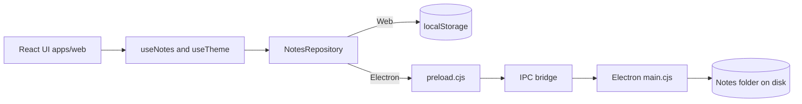
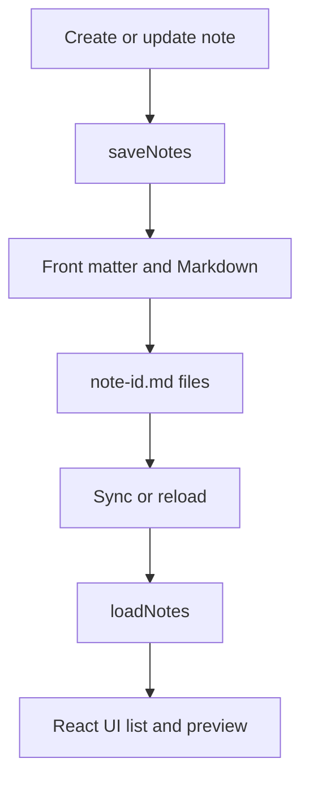

# Personal Notes

Personal Notes is a local-first Markdown notes app with a Vite + React renderer and an optional Electron shell for desktop-only integrations (tray, global shortcut, and file-based storage). The web build persists to localStorage, while the Electron build syncs to a folder of Markdown files.

## Features
- Markdown editor with live preview (GFM support).
- Tags, search, and auto-sorting by last updated.
- Theme palette with persisted selection and cross-tab sync.
- Local-first storage: browser localStorage or file-based notes in Electron.
- Quick capture window via tray click or `Cmd/Ctrl+Shift+N`.

## Architecture




## Project Layout
- `apps/web/` React renderer, Tailwind styles, and tests.
- `apps/web/src/persistence/` storage boundary (localStorage vs Electron IPC).
- `apps/electron/` Electron main/preload scripts and assets.
- `electron-builder.yml` packaging config for desktop builds.
- `Dockerfile`, `nginx.conf` static web deployment.

## Getting Started
### Prerequisites
- Node.js 20+
- npm 9+

### Install
```bash
npm install
```

### Run the web app (localStorage)
```bash
npm run dev:web
```
Open `http://localhost:5173`.

### Run the Electron app (file-based notes)
```bash
npm run dev:electron
```
The Electron shell waits for the Vite dev server and then loads the renderer.

### Build
```bash
npm run build:web
```

### Test, lint, format
```bash
npm run test:web
npm run lint:web
npm run format:web
```

## Notes Persistence
### Web
The default repository is `LocalStorageNotesRepository`, which stores notes in:
- localStorage key: `personal-notes-v1`

### Electron
Electron persists notes in a user-selected folder on disk.
- Settings file: `<userData>/settings.json` (stores `notesFolder`)
- Notes files: `note-<id>.md`

Front matter format:
```text
---
title: Your title
tags: inbox, idea
createdAt: 1710000000000
updatedAt: 1710000001000
---

# Markdown content
```

Use the **Open folder** button to select a folder before saving notes. The **Sync** action reloads from disk. Quick capture opens from the tray or `Cmd/Ctrl+Shift+N` and uses the same persistence rules.

## Configuration
### Vite base path
Set `VITE_BASE=./` for Electron builds so the renderer loads from packaged assets (already wired in `npm run pack:electron` and `npm run dist:electron`).

## Packaging & Distribution
```bash
npm run pack:electron   # folder output in dist-electron/
npm run dist:electron   # installers (DMG/NSIS/AppImage)
```
`electron-builder.yml` defines targets and embeds the web renderer in `renderer/`.

## Docker (web only)
```bash
docker build -t personal-notes-web .
docker run --rm -p 8080:80 personal-notes-web
```
This serves the Vite build with Nginx.

## Testing Notes
Tests live under `apps/web/src/__tests__/` and use Vitest + React Testing Library. Coverage includes note creation, filtering, persistence boundaries, and theme syncing.

## Changelog
See `CHANGELOG.md` for release history.
